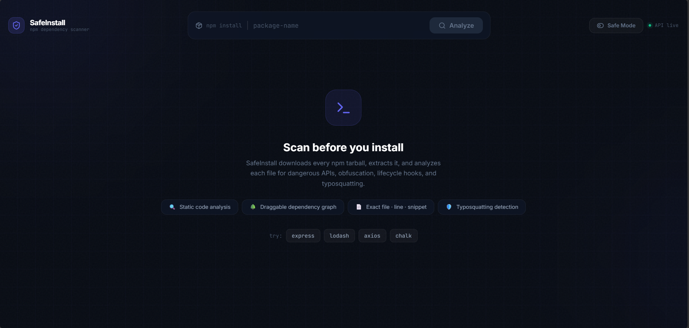
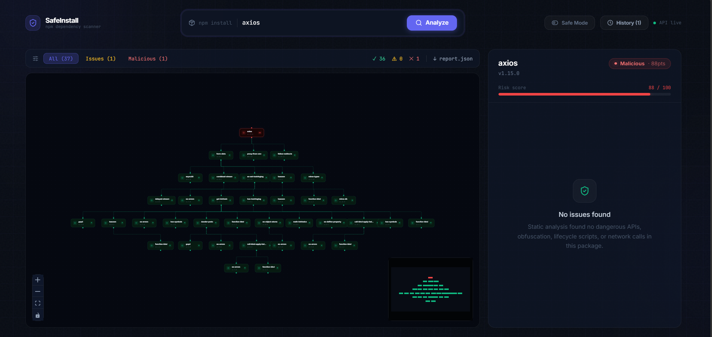
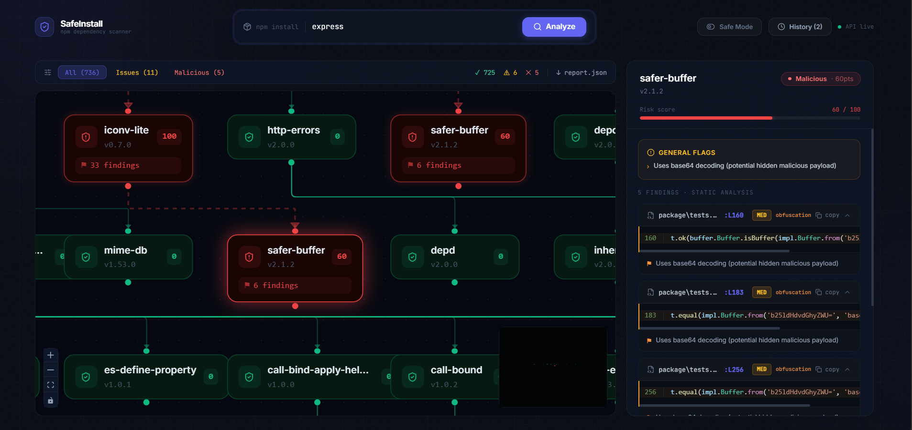

# 🛡️ NpmPkgChecker

[](https://www.npmjs.com/) [](https://nodejs.org/) [](https://react.dev/) [](https://vitejs.dev/) [](https://tailwindcss.com/) [](LICENSE) [](https://github.com/)

**Advanced NPM Package Dependency Scanner & Risk Analyzer**  
Scan NPM packages for risky dependencies, vulnerabilities, similarity issues, and visualize dependency graphs with interactive dashboard.

  
*Scanning NPM package and generating risk report*

## ✨ Features
| Feature | Description |
|---------|-------------|
| 🕵️ **Deep Scanning** | Extracts & analyzes NPM tarballs, detects malicious/duplicate deps |
| 📊 **Dependency Graphs** | Interactive node graphs powered by XYFlow & Recharts |
| ⚠️ **Risk Engine** | Scores vulnerabilities, similarity matches, license issues |
| 🔍 **Live Search** | Real-time package search with code snippet viewer |
| 📈 **Visual Reports** | Trees, badges, charts for risks & deps |
| 🚀 **Full-Stack** | Express API + React Dashboard |

## 📸 Screenshots

### Dashboard


### Search & Results


### Dependency Graph


### Risk Badges & Code Viewer


## 🚀 Quickstart

### Prerequisites
- Node.js v20+
- npm/yarn/pnpm

### Backend (API Server)
```bash
cd backend
npm install
npm start  # Runs on http://localhost:5000
```

### Frontend (Dashboard)
```bash
cd frontend
npm install
npm run dev  # Runs on http://localhost:5173
```

**Access**: Open `http://localhost:5173` – scans hit `/api/scan` endpoint.

## 🛠 API Endpoints
| Endpoint | Method | Description |
|----------|--------|-------------|
| `/api/scan` | POST | `{ pkgName: string, version?: string }` – Scan package |
| `/api/scan/risks` | GET | Get risk scores for deps |
| `/api/graph` | POST | Generate dependency graph |

Example:
```bash
curl -X POST http://localhost:5000/api/scan -H "Content-Type: application/json" -d '{"pkgName": "lodash", "version": "^4.17.21"}'
```

## 🏗 Architecture
```
NpmPkgChecker
├── backend/ (Express API)
│   ├── services/ (scanner, riskEngine, dependencyService)
│   └── routes/ (scanRoutes)
└── frontend/ (Vite + React)
    └── src/components/ (Dashboard, Graphs, Viewer)
```

## Tech Stack
| Category | Technologies |
|----------|--------------|
| Backend | Node.js, Express 5, tar, fs-extra |
| Frontend | React 19, Vite 5, TailwindCSS 3 |
| Viz | Recharts, @xyflow/react |
| Utils | react-syntax-highlighter, Lucide icons |

## 🤝 Contributing
1. Fork & clone
2. `npm install` in both dirs
3. Create feature branch
4. PR to `main`

Issues/PRs welcome!

## 📄 License
MIT – See [LICENSE](LICENSE)

## 🙌 Support
⭐ Star on GitHub | 🚀 [Deploy](https://vercel.com/new) | 💬 [Discord](https://discord.gg/)

---

*Built with ❤️ by [Your Name] – v1.0.0*

